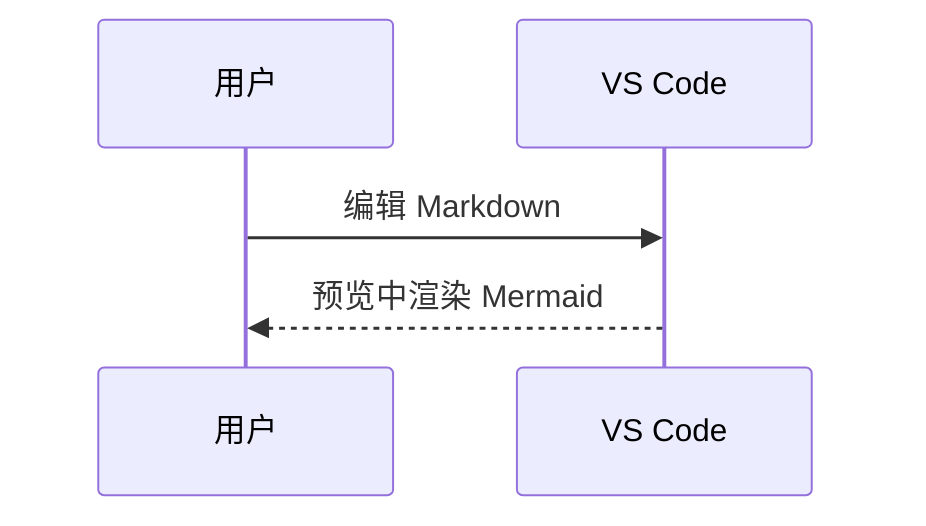

# Markdown 中的 Mermaid

打开内置 Markdown 预览（Cmd/Ctrl+Shift+V）即可看到渲染后的图表：

```mermaid
sequenceDiagram
    participant U as 用户
    participant V as VS Code
    U->>V: 编辑 Markdown
    V-->>U: 预览中渲染 Mermaid
```
